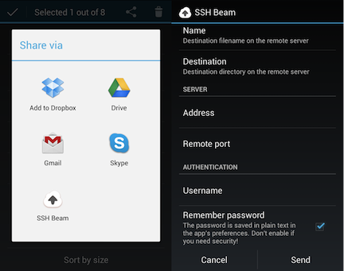

## SSH Beam

SSH Beam is a simple Android app that can _share_ things to an SSH server.

  * Find something to share
  * Click *Share* and select *SSH Beam*
  * Enter the required information
  * Click *Send*
  * Wait until done

At the moment, I'm only checking if the file exists on the server (in which
case I don't overwrite), but that's it. Use at your own risk.

## Use cases

I just built this to scratch an itch, but you can use it for a whole lot of things :

  * Setup a cron job that publishes posts from a specific directory on your
    server, and then publish posts with SSH Beam from your Android device.
  * Send torrents to a directory watched by [rTorrent](http://libtorrent.rakshasa.no/)
  * ...and much more!

## Public keys

SSH Beam can generate public keys, which you can then setup on your server. Use
the "Share public key" menu item to send them by any way you want.

## Building

Use the latest SBT-Android snapshot (0.7-SNAPSHOT from [my
branch](https://github.com/fxthomas/android-plugin/tree/rewrite-cleanup) at the
moment), and run `apk` to package the app.

## Copyright

This was made by me, François-Xavier Thomas, but you can pretty much use the
source and the app however you want. This is therefore licensed under the
[WTFPL](http://www.wtfpl.net/about/).

Just be nice and credit me, send me an email, chocolates or gifts of any kind
if you ever decide to use the source for your own purposes.

Icon under CC-BY-SA by [Dutch Icon](http://dutchicon.com/) (via [Smashing
Magazine](http://www.smashingmagazine.com/2012/11/11/dutch-icon-set-smashing-edition/)),
since I don't really have the time to make a cool icon. Thanks a lot guys!
